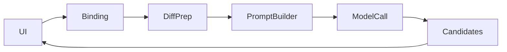

# ai-commit-parity 方案

## 0. 术语约定

- `staged-only`：只基于暂存区 diff 生成候选。
- `摘要化`：二进制、大文件、锁文件不全量发送给模型，而是转成裁剪后的描述。

## 1. 决策与约束

- 需求摘要：把 AI commit 生成流程迁移到 Go，并保持 staged-only、三候选和前端设置结构不变。成功标准是前端仍能生成并使用候选；不做设置页重构。
- 复杂度档位：走默认档位，无偏离。
- 关键决策：
  - 复用现有设置字段，不改 UI 存储结构。
  - 先迁移 Prompt 构建和模型请求行为，不额外优化提示词。
  - 摘要化规则与 staged-only 是硬约束，不能为“先跑通”而放宽。
- Top 3 风险：
  - 未暂存内容被误带入。缓解：契约与验收明确只读 staged diff。
  - 摘要化遗漏导致超大输入。缓解：沿用现有裁剪规则语义。
  - 返回候选结构变化导致 UI 面板异常。缓解：保持 `CommitCandidate[]` 字段不变。

## 2. 名词与编排

### 2.1 名词层

- 现状：[`src/app/api.ts`](E:/github/git-monorepo-tools/src/app/api.ts) 通过 `/api/repos/:id/generate-commit` 调用 Node 逻辑；设置结构在 [`src/app/types.ts`](E:/github/git-monorepo-tools/src/app/types.ts) 的 `AICommitSettings`。
- 变化：
  - Go 绑定实现 `GenerateCommitCandidates(repoId, request, aiCommit, styleHint?)`。
  - `AICommitSettings` 与 `CommitCandidate` 字段保持不变。

### 2.2 编排层

- 现状：Node 先读取 staged diff，再做预处理、提示词构建和模型请求。
- 变化：相同流程迁到 Go 服务，但调用入口改为 Wails 绑定。
- 流程级约束：
  - 无暂存内容时必须显式失败或返回空候选语义，不能伪造成功。
  - 未暂存文件不得进入请求。
  - 二进制、大文件、锁文件继续走摘要化。

### 2.3 挂载点清单

- Wails 绑定：`GenerateCommitCandidates` — 新增
- AI 设置输入：复用前端 `AICommitSettings` — 修改消费方

### 2.4 推进策略

1. 输入对齐：接入现有 `AICommitSettings` 与请求参数。
   - 退出信号：前端能向 Go 绑定传递完整 AI 设置。
2. staged diff 预处理：迁移 staged-only 与摘要化逻辑。
   - 退出信号：输入样本满足暂存区与裁剪约束。
3. 候选生成：迁移提示词构建与模型调用。
   - 退出信号：前端收到与现有结构兼容的候选数组。
4. 烟测：验证正常与空暂存错误路径。
   - 退出信号：核心 AI commit 场景具备证据。

### 2.5 结构健康度与微重构

##### 评估

- 文件级 — 现有 AI 逻辑集中在 Node 脚本，本次迁移到 Go，无需先重构前端。
- 目录级 — 新增 AI 服务代码落在宿主后端目录，不增加前端目录拥挤度。

##### 结论：不做

## 3. 验收契约

### 关键场景清单

- 有暂存内容时可生成候选数组并在前端面板使用。
- 未暂存文件不会进入模型输入。
- 二进制/大文件/锁文件继续被摘要化。
- 无暂存内容时显式失败或返回等价错误语义。
- 明确不做反向核对：本 feature 不改 AI 设置页字段。

### Acceptance Coverage Matrix

| Scenario | Covered By Step | Evidence Type | Command / Action | Core? |
|---|---|---|---|---|
| 正常生成候选 | S3 | acceptance report | 手工生成 commit 候选 | yes |
| staged-only 约束生效 | S2 | diff review | 对比发送内容 | yes |
| 无暂存错误显式暴露 | S4 | screenshot | 手工触发空暂存生成 | no |

### DoD Contract

| ID | 要求 | 证据 | 阻塞级别 |
|---|---|---|---|
| DOD-DESIGN-001 | staged-only 与候选契约明确 | design review | blocking |
| DOD-IMPL-001 | Go 侧可生成候选并保持摘要化约束 | evidence | blocking |
| DOD-REVIEW-001 | review passed | review report | blocking |
| DOD-QA-001 | AI commit 场景验证通过 | QA report | blocking |
| DOD-ACCEPT-001 | roadmap item 回写完成 | acceptance report | blocking |

Validation Commands:

| ID | 命令 | 目的 | 核心性 | 失败处理 |
|---|---|---|---|---|
| CMD-001 | `wails dev` | 验证桌面运行态下的 AI commit 交互 | core | fix-or-block |

## 4. 与项目级架构文档的关系

- 若 AI commit 的 Go 服务边界稳定，acceptance 后可沉淀为桌面后端能力之一。
