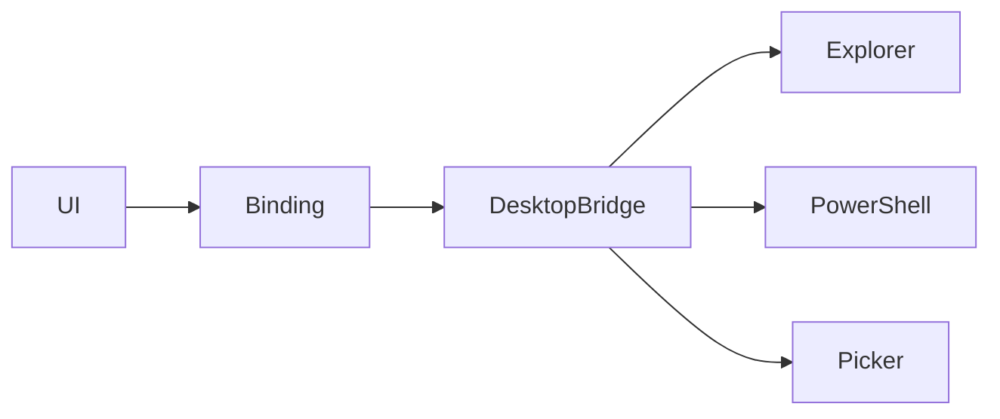

# desktop-bridge-parity 方案

## 0. 术语约定

- `系统动作`：打开文件夹、打开终端、打开冲突工具、目录选择器。
- `Windows 等价`：继续使用资源管理器、PowerShell、`git mergetool` 的行为语义。

## 1. 决策与约束

- 需求摘要：迁移目录选择与本机动作桥接到 Go/Wails。成功标准是前端可通过 Wails 调起这些动作；不做跨平台抽象扩展。
- 复杂度档位：走默认档位，无偏离。
- 关键决策：
  - 第一阶段只保 Windows 等价，不引入泛化平台层。
  - `path` 校验必须显式失败，不默默忽略。
  - 这些动作本身不改仓库状态。
- Top 3 风险：
  - Windows 命令转义差异。缓解：保持路径校验和最小命令集。
  - Wails 文件夹选择器与 PowerShell 现有语义不一致。缓解：实现阶段明确核对返回路径格式。
  - 本机动作成功但 UI 误以为已改状态。缓解：契约中明确这些动作只返回成功/失败。

## 2. 名词与编排

### 2.1 名词层

- 现状：[`scripts/local-system.mjs`](E:/github/git-monorepo-tools/scripts/local-system.mjs) 暴露 `openFolder`、`openTerminal`、`openConflictTool`、`pickFolder`。
- 变化：
  - Go 侧新增 `OpenFolder`、`OpenTerminal`、`OpenConflicts`、`PickFolder` 绑定。
  - 返回值保持 `void` 或 `string | null`，不引入额外包装对象。

### 2.2 编排层

- 现状：Vite 本地 API 接到 `/api/system/pick-folder` 或 `open-*` 后转调 Node 子进程。
- 变化：前端直接调用 Wails 绑定，Go 桥接层执行等价本机动作。
- 流程级约束：
  - 空路径必须失败。
  - `PickFolder` 可返回 `null` 表示用户取消。
  - 动作完成后前端可复用现有刷新策略，但桥接自身不负责刷新状态。

### 2.3 挂载点清单

- Wails 绑定：`OpenFolder` — 新增
- Wails 绑定：`OpenTerminal` — 新增
- Wails 绑定：`OpenConflicts` — 新增
- Wails 绑定：`PickFolder` — 新增

### 2.4 推进策略

1. 目录选择：迁移 `PickFolder`。
   - 退出信号：用户可选择目录并返回标准路径或取消。
2. 本机动作：迁移打开文件夹、终端、冲突工具。
   - 退出信号：前端动作按钮均可触发对应系统行为。
3. 错误与路径校验。
   - 退出信号：空路径和异常场景显式失败。
4. Windows 烟测。
   - 退出信号：四类动作均具备手工证据。

### 2.5 结构健康度与微重构

##### 评估

- 文件级 — `scripts/local-system.mjs`：职责单一，本 feature 目标是迁移离开，不必先拆。
- 目录级 — 新增桥接代码落在新宿主目录，当前前端目录不承压。

##### 结论：不做

## 3. 验收契约

### 关键场景清单

- 点击“选择目录”可返回所选路径，取消时返回 `null`。
- 点击“打开文件夹/终端/冲突工具”能触发相应本机动作。
- 传入空路径时显式失败。
- 明确不做反向核对：本 feature 不处理跨平台兼容。

### Acceptance Coverage Matrix

| Scenario | Covered By Step | Evidence Type | Command / Action | Core? |
|---|---|---|---|---|
| 目录选择可用 | S1 | screenshot | 手工选择目录 | yes |
| 三类本机动作可触发 | S2 | screenshot | 手工点击动作按钮 | yes |
| 空路径显式失败 | S3 | acceptance report | 触发非法参数 | no |

### DoD Contract

| ID | 要求 | 证据 | 阻塞级别 |
|---|---|---|---|
| DOD-DESIGN-001 | 桥接契约和边界明确 | design review | blocking |
| DOD-IMPL-001 | 四类系统动作在 Wails 下可用 | screenshot | blocking |
| DOD-REVIEW-001 | review passed | review report | blocking |
| DOD-QA-001 | 手工桥接验证通过 | QA report | blocking |
| DOD-ACCEPT-001 | roadmap item 回写完成 | acceptance report | blocking |

Validation Commands:

| ID | 命令 | 目的 | 核心性 | 失败处理 |
|---|---|---|---|---|
| CMD-001 | `wails dev` | 验证桌面桥接行为 | core | fix-or-block |

## 4. 与项目级架构文档的关系

- 若系统桥接稳定，可在 acceptance 后记录 Windows 桌面动作约束。
