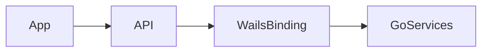

# frontend-transport-cutover 方案

## 0. 术语约定

- `传输层`：`src/app/api.ts` 及其调用点。
- `Wails 绑定调用`：前端直接调用 Go 暴露的方法，而非发 HTTP 到 `/api/*`。

## 1. 决策与约束

- 需求摘要：将前端所有本地能力调用从 `/api/*` fetch 切到 Wails 绑定。成功标准是 React UI 不再依赖 Vite 本地 API；不做 UI 重构。
- 复杂度档位：走默认档位，无偏离。
- 关键决策：
  - 尽量把改动收敛在 `src/app/api.ts` 与少量调用点，避免 UI 全面改写。
  - 保持前端函数名与返回值形状稳定，如 `fetchSnapshot`、`runBatch`、`pickFolder`。
  - 不保留“双通道回退”以免隐藏迁移失败。
- Top 3 风险：
  - 某些调用点仍残留 `/api/*` 假设。缓解：以 `src/app/api.ts` 为唯一传输入口集中替换。
  - 错误处理语义变化。缓解：保留 rejected promise 模式。
  - 开发态与生产态调用环境不一致。缓解：以 Wails 运行态作为唯一目标环境。

## 2. 名词与编排

### 2.1 名词层

- 现状：[`src/app/api.ts`](E:/github/git-monorepo-tools/src/app/api.ts) 暴露 `fetchSnapshot`、`mutateRepo`、`runBatch`、`fetchRepoLog`、`generateCommitCandidates`、`pickFolder` 等函数，内部通过 `fetch('/api/...')`。
- 变化：
  - 同名函数改为调用 Wails 绑定。
  - `request()` 内部不再依赖 HTTP 响应码，而是处理绑定异常。
  - `INITIAL_SNAPSHOT` 仍只作静态启动回退展示，不再作为宿主成功路径。

### 2.2 编排层

- 现状：React 组件统一通过 `src/app/api.ts` 发 HTTP 请求到 Vite 中间件。
- 变化：组件继续只依赖 `src/app/api.ts`，但该层改为直连 Wails 绑定。
- 流程级约束：
  - 所有错误继续以抛异常的形式回到组件层。
  - 不保留 Node/Vite 回退通道。
  - 所有桌面动作、Git 操作、AI commit 调用都必须走绑定层。

### 2.3 挂载点清单

- 前端传输入口：`src/app/api.ts` — 修改
- Wails 运行时绑定导入点 — 新增

### 2.4 推进策略

1. 绑定导入：建立前端可调用的 Wails 方法映射。
   - 退出信号：`src/app/api.ts` 能访问全部绑定方法。
2. 传输替换：逐项替换 snapshot、repo action、batch、log、AI、folder 调用。
   - 退出信号：前端不再发 `/api/*` 请求。
3. 错误语义校准。
   - 退出信号：组件层仍按 rejected promise 处理失败。
4. 关键交互烟测。
   - 退出信号：首屏、仓库操作、AI、目录选择均可从 UI 走通。

### 2.5 结构健康度与微重构

##### 评估

- 文件级 — `src/app/api.ts`：是单一传输入口，虽然会集中改动，但职责仍聚焦，暂不拆分。
- 目录级 — `src/app/` 当前结构清晰，本次不新增大量前端文件。

##### 结论：不做

## 3. 验收契约

### 关键场景清单

- 首屏、单仓库操作、批量操作、日志、AI commit、目录选择都通过 Wails 绑定运行。
- 前端不再请求 `/api/*`。
- 失败场景仍以 rejected promise 回到组件层。
- 明确不做反向核对：本 feature 不新增新的前端功能或页面。

### Acceptance Coverage Matrix

| Scenario | Covered By Step | Evidence Type | Command / Action | Core? |
|---|---|---|---|---|
| 无 `/api/*` 请求残留 | S2 | diff review | 搜索与运行态观察 | yes |
| 关键 UI 交互可用 | S4 | screenshot | 手工烟测 | yes |
| 错误继续抛异常 | S3 | acceptance report | 触发失败路径 | no |

### DoD Contract

| ID | 要求 | 证据 | 阻塞级别 |
|---|---|---|---|
| DOD-DESIGN-001 | 前端传输边界清晰 | design review | blocking |
| DOD-IMPL-001 | React UI 不再依赖 `/api/*` | diff review + smoke | blocking |
| DOD-REVIEW-001 | review passed | review report | blocking |
| DOD-QA-001 | 核心 UI 场景验证通过 | QA report | blocking |
| DOD-ACCEPT-001 | roadmap item 回写完成 | acceptance report | blocking |

Validation Commands:

| ID | 命令 | 目的 | 核心性 | 失败处理 |
|---|---|---|---|---|
| CMD-001 | `wails dev` | 验证前端交互运行态 | core | fix-or-block |

## 4. 与项目级架构文档的关系

- 若 `src/app/api.ts` 成为稳定的 Wails 前端桥接层，acceptance 后可沉淀成新的前端边界约定。
