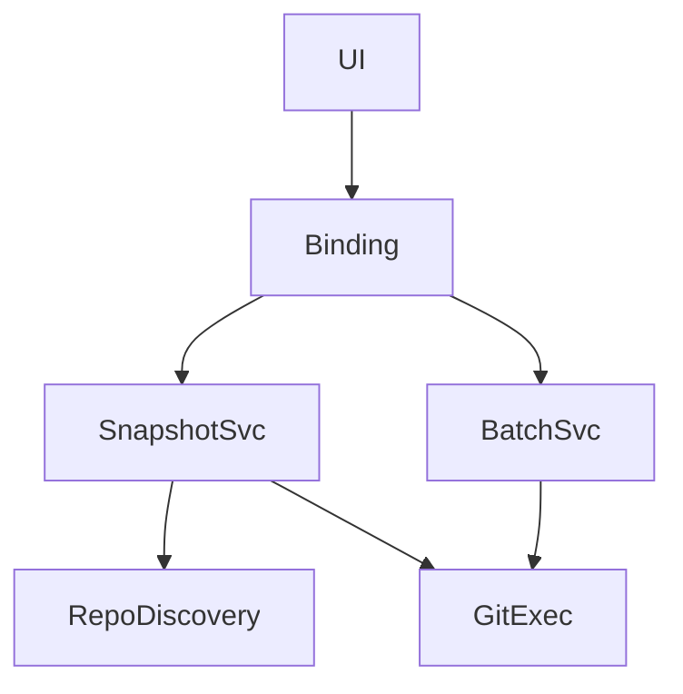

# git-operation-parity 方案

## 0. 术语约定

- `Git 应用服务`：Go 中承载仓库扫描、状态构建和 Git 命令执行的业务层。
- `错误语义等价`：沿用当前 Node 实现向用户暴露的中文错误、跳过和失败分类。

## 1. 决策与约束

- 需求摘要：迁移 snapshot、log、stage/unstage、commit、pull、push、pullAll、pushAll 到 Go。成功标准是这些能力不再依赖 Node 运行时；不做 AI commit、不做系统动作。
- 复杂度档位：走迁移默认档位，无偏离。
- 关键决策：
  - 先追求行为等价，再考虑内部 Go 抽象优化。
  - Git 命令仍以系统 Git 子进程执行，不引入新 Git 库。
  - 批量操作继续复用当前 `pulled/pushed/skipped/failed/uptodate` 结果语义。
- 非显然依赖：依赖 `wails-shell-bootstrap` 已冻结 `AppSnapshot` 契约。
- Top 3 风险：
  - 错误文本漂移。缓解：对照现有 Node 分支条件逐项迁移。
  - 快照排序或字段差异导致 UI 误判。缓解：先对齐现有 `buildAppSnapshot` 行为。
  - 批量操作跳过条件丢失。缓解：将现有分支规则列入验收场景。

## 2. 名词与编排

### 2.1 名词层

- 现状：[`scripts/sync-real-data.mjs`](E:/github/git-monorepo-tools/scripts/sync-real-data.mjs) 负责构建 `AppSnapshot`、执行单仓库和批量 Git 操作。
- 变化：
  - 新增 Go `GitService` / `SnapshotService` 等价承载层。
  - 前端继续消费原有 `AppSnapshot`、`RepoDetail`、`PullResult`。
  - 新增 `MutateRepo`、`RunBatch`、`GetRepoLog` 的 Go 绑定实现。

接口示例：

```ts
await MutateRepo(repoId, 'pull', request, {});
await RunBatch('push', request);
await GetRepoLog(repoId, request);
```

### 2.2 编排层



- 现状：Node 在 `handleApiRequest` 中分发动作，再调用 `sync-real-data.mjs` 的各导出函数。
- 变化：
  - Go 绑定层直接分发到 Git 应用服务。
  - 每个动作继续“执行后重建最新快照”而不是局部拼接结果。
- 流程级约束：
  - `pull` 在有未提交改动时必须显式失败。
  - `push` 在无 upstream 时必须显式失败。
  - `pullAll/pushAll` 跳过条件必须与现有 Node 语义一致。

### 2.3 挂载点清单

- Wails 绑定：`MutateRepo` — 新增
- Wails 绑定：`RunBatch` — 新增
- Wails 绑定：`GetRepoLog` — 新增
- Go 子进程执行器：Git 命令入口 — 新增

### 2.4 推进策略

1. 快照服务：迁移仓库发现、状态解析与 `AppSnapshot` 构建。
   - 退出信号：首屏快照与当前 Node 版本字段对齐。
2. 单仓库操作：迁移 stage/unstage/commit/pull/push/log。
   - 退出信号：核心单仓库动作均能通过 Go 绑定执行。
3. 批量操作：迁移 pullAll/pushAll 与结果分类。
   - 退出信号：跳过、失败、成功语义可重现。
4. 回归烟测：覆盖典型成功与失败路径。
   - 退出信号：核心 Git 场景具备命令或手工证据。

### 2.5 结构健康度与微重构

##### 评估

- 文件级 — `scripts/sync-real-data.mjs`：职责较多，但本 feature 是迁移离开该文件，不需要先在 Node 内拆分。
- 目录级 — 目标 Go 服务目录为新建目录，可按服务职责直接分层，不存在摊平继承。

##### 结论：不做

本 feature 直接在 Go 侧建立清晰结构，比先改 Node 文件更低风险。

## 3. 验收契约

### 关键场景清单

- 通过 Go 绑定获取的快照字段与当前 UI 预期一致。
- 单仓库 `stage-all`、`commit`、`pull`、`push` 能执行，并在失败时暴露与现有语义等价的中文错误。
- `pullAll` 在 upstream 缺失、分叉、冲突、本地脏工作区时保持跳过或失败语义。
- `pushAll` 在无提交可推送时返回 `uptodate`。
- 明确不做反向核对：本 feature 不要求迁移 AI commit。

### Acceptance Coverage Matrix

| Scenario | Covered By Step | Evidence Type | Command / Action | Core? |
|---|---|---|---|---|
| 快照字段对齐 | S1 | diff review | 对比前后快照字段 | yes |
| 单仓库操作可执行 | S2 | command | 触发 stage/commit/pull/push | yes |
| 批量操作跳过语义一致 | S3 | acceptance report | 构造典型仓库状态 | yes |
| 不迁移 AI commit | S4 | diff review | 检查无 AI 绑定实现 | no |

### DoD Contract

| ID | 要求 | 证据 | 阻塞级别 |
|---|---|---|---|
| DOD-DESIGN-001 | Git 服务边界和错误语义明确 | design review | blocking |
| DOD-IMPL-001 | 核心 Git 操作已从 Go 绑定可用 | command evidence | blocking |
| DOD-REVIEW-001 | review passed | review report | blocking |
| DOD-QA-001 | 关键成功/失败场景覆盖 | QA report | blocking |
| DOD-ACCEPT-001 | roadmap item 回写完成 | acceptance report | blocking |

Validation Commands:

| ID | 命令 | 目的 | 核心性 | 失败处理 |
|---|---|---|---|---|
| CMD-001 | `wails dev` | 验证桌面运行态下的 Git 操作链路 | core | fix-or-block |

## 4. 与项目级架构文档的关系

- 若 Go Git 服务分层稳定，acceptance 后应沉淀新的桌面后端边界。
