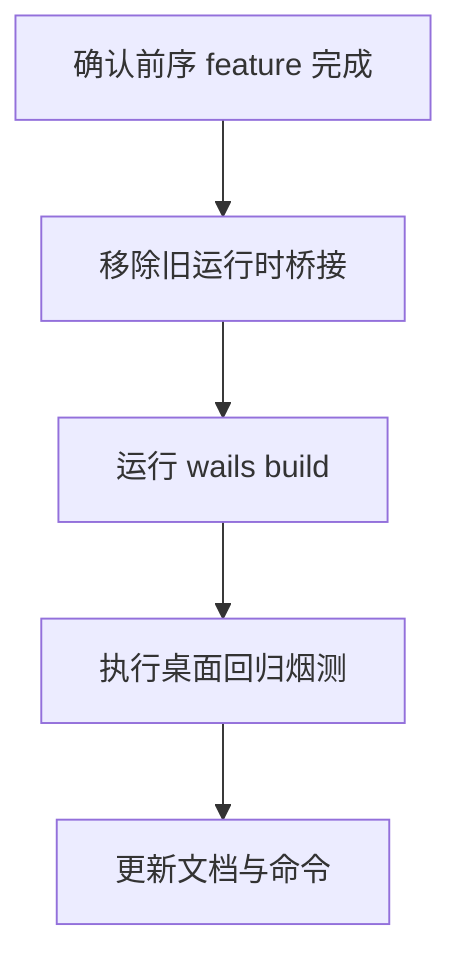

# node-removal-and-regression 方案

## 0. 术语约定

- `Node 运行时依赖`：应用在桌面运行中必须依赖的 `scripts/vite-git-api.mjs`、`scripts/local-system.mjs`、`scripts/sync-real-data.mjs` 等桥接逻辑。
- `回归收口`：对核心桌面路径做一次整体验证并同步文档。

## 1. 决策与约束

- 需求摘要：在前端已切到 Wails 绑定后，移除 Node 本地 API 运行时依赖，补齐文档并完成回归。成功标准是 `wails build` 可产出桌面包；不做额外功能开发。
- 复杂度档位：走默认档位，无偏离。
- 关键决策：
  - 只删除已被 Wails 替代的运行时桥接，不清理仍有独立用途的辅助脚本。
  - 回归必须覆盖首屏、单仓库、批量、AI、目录选择和本地动作。
  - 文档与命令同步是交付物，不是可选附带项。
- Top 3 风险：
  - 删除过早导致仍有残留依赖。缓解：在删除前先通过运行态与搜索确认切换完成。
  - `wails build` 暴露新的打包问题。缓解：把构建验证放进核心命令。
  - 文档仍指向旧 Node 入口。缓解：把命令与说明纳入验收场景。

## 2. 名词与编排

### 2.1 名词层

- 现状：当前仓库运行入口主要仍是 `npm run dev/build/preview` 与 Vite 中间件脚本。
- 变化：
  - 运行时桌面入口改为 Wails dev/build。
  - 旧 Node 本地 API 脚本被删除或停用。
  - 开发文档更新为新的桌面入口。

### 2.2 编排层

- 现状：桌面运行依赖 Node 脚本桥接。
- 变化：切换完成后，Node 桥接从运行时主路径移除，由 Wails 宿主接管。
- 流程级约束：
  - 不能删除仍被运行态使用的脚本。
  - `wails build` 是核心阻塞验证。
  - 回归不允许只凭口头说明通过。

### 2.3 挂载点清单

- 运行时桌面入口：Wails dev/build — 修改主入口
- 仓库文档命令入口：README / 等价文档 — 修改
- Node 本地 API 脚本引用 — 删除或停用

### 2.4 推进策略

1. 依赖盘点：确认 Node 本地 API 已不在运行态主路径。
   - 退出信号：可列出待删或待停用桥接清单。
2. 清理运行时桥接。
   - 退出信号：运行态不再依赖旧 Node 本地 API。
3. 构建验证：执行 `wails build`。
   - 退出信号：桌面包可成功产出。
4. 回归与文档同步。
   - 退出信号：核心路径烟测通过且文档更新完毕。

### 2.5 结构健康度与微重构

##### 评估

- 文件级 — 本 feature 主要是删除旧脚本引用和更新文档，不涉及向胖文件继续塞逻辑。
- 目录级 — 删除旧脚本后目录更简洁，不需要额外重组。

##### 结论：不做

## 3. 验收契约

### 关键场景清单

- 运行态不再依赖旧 Node 本地 API。
- `wails build` 成功。
- 首屏、单仓库操作、批量操作、AI commit、目录选择、本地动作完成一次桌面回归。
- 文档中的开发/构建命令已更新。
- 明确不做反向核对：本 feature 不新增新桌面能力。

### Acceptance Coverage Matrix

| Scenario | Covered By Step | Evidence Type | Command / Action | Core? |
|---|---|---|---|---|
| 旧 Node 运行时依赖已移除 | S2 | diff review | 搜索与文件清单核验 | yes |
| `wails build` 成功 | S3 | command | `wails build` | yes |
| 核心桌面路径回归通过 | S4 | screenshot | 手工烟测 | yes |
| 文档命令已更新 | S4 | diff review | 核对 README/说明 | no |

### DoD Contract

| ID | 要求 | 证据 | 阻塞级别 |
|---|---|---|---|
| DOD-DESIGN-001 | 清理边界与回归范围明确 | design review | blocking |
| DOD-IMPL-001 | Node 运行时依赖移除且 Wails 构建成功 | command + diff | blocking |
| DOD-REVIEW-001 | review passed | review report | blocking |
| DOD-QA-001 | 桌面回归通过 | QA report | blocking |
| DOD-ACCEPT-001 | roadmap item 回写完成 | acceptance report | blocking |

Validation Commands:

| ID | 命令 | 目的 | 核心性 | 失败处理 |
|---|---|---|---|---|
| CMD-001 | `wails build` | 验证桌面打包产物 | core | fix-or-block |
| CMD-002 | `wails dev` | 验证运行态桌面回归 | core | fix-or-block |

## 4. 与项目级架构文档的关系

- 若 Wails 成为唯一桌面运行时入口，应在 acceptance 后回写需求层与开发文档。
