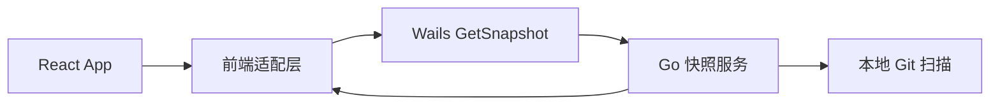

# wails-shell-bootstrap 方案

## 0. 术语约定

- `Wails 宿主`：桌面窗口生命周期与 Go 绑定暴露层。防冲突结论：区别于当前 `vite-git-api.mjs` 中间件。
- `快照绑定`：前端调用 Go 并获取 `AppSnapshot` 的桥接方法。防冲突结论：沿用 `src/app/types.ts` 中现有快照语义。

## 1. 决策与约束

- 需求摘要：建立 Wails2 工程，保留现有 React UI，首屏从 Go 绑定获取真实仓库快照。成功标准是 `wails dev` 能显示真实仓库列表；不做 Git 写操作迁移、不做跨平台对齐。
- 复杂度档位：走桌面迁移默认档位，无偏离。
- 关键决策：
  - 首条 feature 只冻结宿主与 DTO 契约，不混入完整 Git 行为迁移。
  - 首屏数据继续使用现有 `AppSnapshot` 形状，避免前端与宿主同时漂移。
  - Wails 开发入口成为新主入口，但暂不删除 Node 运行时脚本。
- 关键假设：
  - 本机可安装并运行 Wails2 与 Go。
  - 现有前端构建产物可被 Wails 正常加载。
- Top 3 风险：
  - DTO 漂移。缓解：仅暴露 `GetSnapshot`，字段名完全对齐现有类型。
  - 宿主加载前端失败。缓解：先验证静态页面加载，再接 Go 绑定。
  - 开发入口混乱。缓解：显式写清 `wails dev` 与当前 `npm run dev` 的角色。

## 2. 名词与编排

### 2.1 名词层

- 现状：前端通过 [`src/app/api.ts`](E:/github/git-monorepo-tools/src/app/api.ts) 的 `/api/snapshot` 获取 `AppSnapshot`；快照结构定义在 [`src/app/types.ts`](E:/github/git-monorepo-tools/src/app/types.ts)。
- 变化：
  - 新增 `GetSnapshot(request)` Wails 绑定，返回 `AppSnapshot`。
  - 新增 Wails 宿主配置与 Go `App` 入口。
  - 保持 `AppSnapshot`、`RepoDetail`、`PullResult` 字段名不变。

接口示例：

```ts
const snapshot = await GetSnapshot({
  scanRoots: [],
  pullStrategy: 'ff-only',
  pushStrategy: 'upstream-only',
});
```

### 2.2 编排层



- 现状：Vite 中间件在 [`scripts/vite-git-api.mjs`](E:/github/git-monorepo-tools/scripts/vite-git-api.mjs) 拦截 `/api/snapshot`，转调 Node 快照逻辑。
- 变化：
  - 前端开发时由 Wails 宿主启动页面并注入 Go 绑定。
  - 首屏只走 `GetSnapshot` 一条真实链路，其他动作继续留在后续 feature。
- 流程级约束：
  - 绑定失败必须显式抛错，不做静默回退。
  - 无仓库时 `selectedRepoId` 返回空字符串。
  - 首屏加载成功证据必须来自真实仓库扫描，而非静态假数据。

### 2.3 挂载点清单

- 桌面宿主入口：Wails `main` / `App` 启动配置 — 新增
- 前端快照入口：`GetSnapshot` 绑定导出 — 新增
- 开发命令入口：Wails dev/build 配置 — 新增

### 2.4 推进策略

1. 建立 Wails 工程骨架并加载现有前端。
   - 退出信号：`wails dev` 能打开窗口并渲染现有 UI 外壳。
2. 接入最小 Go `GetSnapshot` 绑定。
   - 退出信号：前端能通过绑定拿到真实 `AppSnapshot`。
3. 校准开发命令与文档。
   - 退出信号：README 或等价说明能指向新的首屏启动方式。
4. 做首屏烟测。
   - 退出信号：仓库列表、选中仓库与基本状态可见。

### 2.5 结构健康度与微重构

##### 评估

- 文件级 — `src/app/api.ts`：当前职责集中在 fetch 包装，首条 feature 只需最小接入，不必先拆。
- 目录级 — `src/app/`：当前文件量可控，本次新增宿主代码主要落在新建 Wails/Go 目录，不向前端目录堆积多文件。

##### 结论：不做

本 feature 不先做微重构，原因是首条目标是冻结宿主契约，先新增宿主层更稳。

## 3. 验收契约

### 关键场景清单

- 启动 `wails dev` 后显示现有应用窗口与首屏框架。
- 首屏请求真实快照后显示至少一个仓库或空仓库状态，而不是静态 `INITIAL_SNAPSHOT`。
- 绑定失败时界面显式报错，不静默成功。
- 明确不做反向核对：本 feature 不要求 pull/push/commit 等交互已迁移。

### Acceptance Coverage Matrix

| Scenario | Covered By Step | Evidence Type | Command / Action | Core? |
|---|---|---|---|---|
| Wails 窗口能加载前端 | S1 | command | `wails dev` | yes |
| 首屏拿到真实快照 | S2 | screenshot | 打开应用观察仓库列表 | yes |
| 错误显式暴露 | S4 | diff review | 断开绑定或观察错误处理 | no |

### DoD Contract

| ID | 要求 | 证据 | 阻塞级别 |
|---|---|---|---|
| DOD-DESIGN-001 | 宿主与快照契约明确 | design review | blocking |
| DOD-IMPL-001 | Wails 宿主可启动并返回真实快照 | command + screenshot | blocking |
| DOD-REVIEW-001 | review passed | review report | blocking |
| DOD-QA-001 | 首屏场景验证通过 | QA report | blocking |
| DOD-ACCEPT-001 | roadmap item 回写完成 | acceptance report | blocking |

Validation Commands:

| ID | 命令 | 目的 | 核心性 | 失败处理 |
|---|---|---|---|---|
| CMD-001 | `wails dev` | 验证宿主启动与首屏链路 | core | fix-or-block |

## 4. 与项目级架构文档的关系

- 若宿主入口和绑定命名稳定，应在 acceptance 后回写 requirements / architecture。
- 当前仅建立迁移底座，无需立即新增系统术语。
