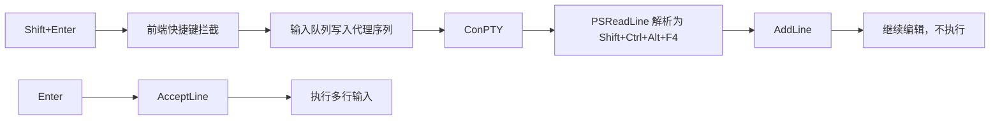

# Windows 终端 Shift+Enter 设计

## 0. 术语约定

- **AddLine**：PSReadLine 的原生动作，在当前命令缓冲区插入一行而不执行。
- **代理按键序列**：应用内部用于把 `Shift+Enter` 表达为 `Shift+Ctrl+Alt+F4` 的 VT 序列 `\x1b[1;8S`；不会显示给用户。
- **普通 Enter**：PSReadLine 的 `AcceptLine` 动作，执行当前完整输入。

## 1. 决策与约束

### 需求摘要

Windows 仓库终端中，`Shift+Enter` 必须与 Windows PowerShell 默认行为一致：进入下一行、保留当前输入、不得执行命令；随后普通 Enter 执行整个多行输入。

明确不做：不改变 macOS、Linux 或其他 shell 的 `Shift+Enter`；不向 PowerShell 直接写入 `\n` 或反引号来伪造续行；不新增 Wails 后端接口。

### 关键决策

- xterm 会把 `Shift+Enter` 降为普通回车，无法把修饰键传给 ConPTY。前端改为拦截此按键并发送私有代理序列。
- 启动脚本必须在加载 PSReadLine 前设置 `PSREADLINE_VTINPUT=1`，使 PSReadLine 确定按 VT 序列解析代理按键；随后把该序列解析出的 `Shift+Ctrl+Alt+F4` 绑定到原生 `AddLine`。这是 PowerShell 自己的多行编辑，不改变命令文本语义。
- 代理序列走现有会话输入队列，确保它与粘贴、普通输入保持既有顺序。

### 约束与风险

- Windows 终端以 pwsh 或 Windows PowerShell 加载 PSReadLine 为启动硬依赖；缺失或加载失败必须在启动终端中显式报错，不允许静默跳过绑定。
- pwsh 是优先 shell，Windows PowerShell 是回退 shell。验收必须记录实际使用的 shell 与 PSReadLine 版本；两者均为支持目标。Windows PowerShell 回退通过临时 PATH 隐藏 pwsh 的方式复现，环境缺少其中一个时要记录为未覆盖而非视作通过。
- 风险一：代理序列编码错误会让按键无效。缓解：单测锁定序列与 PowerShell 绑定。
- 风险二：快捷键误放行会退化为执行命令。缓解：测试断言自定义处理器返回 `false`。
- 风险三：输入队列乱序会让后续 Enter 抢在 AddLine 前。缓解：复用已有输入队列并做顺序验证。

### 验证基线

- `npx tsc -p tsconfig.snapshot-tests.json --noEmit`
- `npm run test:snapshot-coordinator`
- `npm run wails:build`
- Windows 桌面端手工验证 PowerShell 的真实交互。

## 2. 名词与编排

### 2.1 名词层

**现状**：终端快捷键动作只区分复制、粘贴和放行；Windows 启动脚本只调整 Ctrl+L。输入队列将 xterm 数据按会话顺序写入 ConPTY。

**变化**：新增“插入 PowerShell 行”的快捷键动作和代理按键序列。该动作只在 Windows 的无 Ctrl、Alt、Meta 修饰的 `Shift+Enter` 生效；Windows 启动脚本先开启 PSReadLine VT 输入，再注册对应的 `AddLine` 绑定。

接口示例：

```text
Shift+Enter -> \x1b[1;8S -> PSReadLine AddLine -> 当前命令缓冲区增加一行
Enter       -> \r        -> PSReadLine AcceptLine -> 执行整个命令缓冲区
```

##### Interface 设计检查

- Module：终端快捷键判定和 PowerShell 启动脚本，均为既有模块扩展。
- Interface：快捷键层输出内部动作；终端界面负责通过现有 `enqueueTerminalInput` 队列将动作写入会话；启动脚本负责开启 VT 输入并把代理序列绑定为 AddLine。
- Seam：快捷键动作函数是测试入口；启动脚本字符串是 Windows 单测入口。
- Depth / locality：协议细节集中在快捷键和启动脚本内，不向调用方暴露 PowerShell 控制序列。
- Dependency strategy：in-process 前端动作 + 本地 PowerShell/ConPTY 会话；不新增 adapter。
- Test surface：动作判定、代理序列写入、启动脚本绑定和桌面端交互。

### 2.2 编排层



**现状**：自定义按键处理器仅消费 Ctrl+C 和 Ctrl+V；其余按键交给 xterm。xterm 对 `Shift+Enter` 与 Enter 都输出回车。

**变化**：Windows `Shift+Enter` 在自定义按键处理器中转为“插入行”动作并阻止 xterm 默认处理。终端界面使用 `enqueueTerminalInput` 将代理序列接入现有输入队列；启动脚本在 `Import-Module PSReadLine -ErrorAction Stop` 前设置 `PSREADLINE_VTINPUT=1`，再将代理功能键绑定到 AddLine。

流程级约束：代理序列必须只写入当前存活会话；必须通过 `enqueueTerminalInput` 排在触发后续键盘输入之前；测试必须可观察到代理序列写入先于随后 Enter 的 `\r`。普通 Enter、Ctrl+C、Ctrl+V、右键粘贴和非 Windows 快捷键保持原有路径。

### 2.3 挂载点清单

- 终端自定义按键处理器：新增 Windows `Shift+Enter` 到插入行动作的挂载。
- Windows PowerShell 启动脚本：新增代理序列到 PSReadLine AddLine 的绑定。

### 2.4 推进策略

1. 扩展快捷键动作契约和单测。
   退出信号：Windows `Shift+Enter` 被消费并只触发一次插入行动作。
2. 扩展 PowerShell 启动配置和 Windows 单测。
   退出信号：启动命令在加载 PSReadLine 前开启 VT 输入，并注册代理功能键到 AddLine 的绑定；加载失败不再被吞掉；现有可注入 shell 查找函数证明 pwsh 优先和 Windows PowerShell 回退均使用同一启动配置。
3. 接通终端输入队列并执行构建验证。
   退出信号：代理序列通过当前会话队列发送，测试证明其先于随后 Enter 的回车写入，类型检查、测试和构建通过。
4. Windows 桌面端验收。
   退出信号：`Shift+Enter` 进入下一编辑行但不执行，普通 Enter 只执行一次完整多行命令；正常 PATH 验证 pwsh，临时 PATH 隐藏 pwsh 后验证 Windows PowerShell 回退，并分别记录覆盖结果。

### 2.5 结构健康度与微重构

##### 评估

- 文件级：终端界面文件已承担生命周期、输入、粘贴和快捷键编排；本次仅在现有快捷键回调增加一个动作，不引入新的职责。
- 文件级：快捷键模块承担动作判定和可测试的输入辅助逻辑，本次动作属于其现有职责。
- 目录级：终端相关组件已经按功能聚集；本次不新增文件。

##### 结论：不做

本次不进行微重构，避免把与 Shift+Enter 无关的终端生命周期逻辑纳入改动。

## 3. 验收契约

### 关键场景清单

1. Windows PowerShell 终端输入完整命令后按 `Shift+Enter`：光标进入下一编辑行，命令不执行。
2. 续行后输入第二行并按 Enter：两行作为一次完整输入执行一次。
3. Windows 下普通 Enter：仍执行当前命令，未被代理序列替代。
4. Windows 下 Ctrl+C、Ctrl+V、右键粘贴：保持现有行为。
5. macOS、Linux 下 `Shift+Enter`：不进入 Windows 专用分支。
6. PowerShell 启动脚本：在加载 PSReadLine 前启用 VT 输入，代理序列映射到 `AddLine`，加载失败显式显示。
7. 代理序列后立即按 Enter：后端输入顺序为代理序列在前、回车在后。
8. 同时安装两种 shell 的机器：正常 PATH 启动 pwsh；临时 PATH 仅保留系统 PowerShell 路径后启动 Windows PowerShell，二者都具有 AddLine 行为。

### 明确不做的反向核对项

- 非 Windows 快捷键判定不得返回 Windows 插入行动作。
- 普通 Enter 不得映射到代理序列。
- 代码不得通过直接写入 `\n` 或反引号模拟 AddLine。

### Acceptance Coverage Matrix

| Scenario | Covered By Step | Evidence Type | Command / Action | Core? |
|---|---|---|---|---|
| Shift+Enter 不执行并进入下一编辑行 | S1, S4 | unit + manual | 快捷键测试、Windows 桌面操作 | yes |
| Enter 执行完整多行输入 | S3, S4 | manual | Windows 桌面操作 | yes |
| PowerShell VT 输入与 AddLine 绑定 | S2 | unit | Windows Go 测试 | yes |
| 代理序列先于后续 Enter | S3 | unit | 输入队列顺序测试 | yes |
| pwsh 优先与 Windows PowerShell 回退 | S2, S4 | unit + manual | 注入式 shell 查找测试、临时 PATH 桌面操作 | yes |
| 既有快捷键不回归 | S1, S3 | unit | `npm run test:snapshot-coordinator` | yes |
| 非 Windows 不受影响 | S1 | unit | 快捷键测试 | no |

### DoD Contract

| ID | 要求 | 证据 | 阻塞级别 |
|---|---|---|---|
| DOD-DESIGN-001 | 设计和清单通过独立审查 | design review | blocking |
| DOD-IMPL-001 | Shift+Enter 到 AddLine 的完整链路实现 | 单测和实现证据 | blocking |
| DOD-REVIEW-001 | 独立代码审查通过 | review 报告 | blocking |
| DOD-QA-001 | 核心场景验证完成 | QA 报告 | blocking |
| DOD-ACCEPT-001 | Windows 实机验收完成并记录 shell/PSReadLine 版本 | acceptance 报告 | blocking |

Validation Commands:

| ID | 命令 | 目的 | 核心性 | 失败处理 |
|---|---|---|---|---|
| CMD-001 | `npx tsc -p tsconfig.snapshot-tests.json --noEmit` | 前端类型检查 | core | fix-or-block |
| CMD-002 | `npm run test:snapshot-coordinator` | 快捷键与输入行为回归 | core | fix-or-block |
| CMD-003 | `go test ./...` | Windows 启动配置回归 | core | fix-or-block |
| CMD-004 | `npm run wails:build` | Windows 应用构建 | core | fix-or-block |

Required Artifacts: design review、code review、QA、acceptance、命令输出和 Windows 桌面端验证记录。

## 4. 与项目级架构文档的关系

本 feature 改动局限在终端输入和 Windows PowerShell 启动内部，无系统级可见的新术语、公开接口或架构决策。
